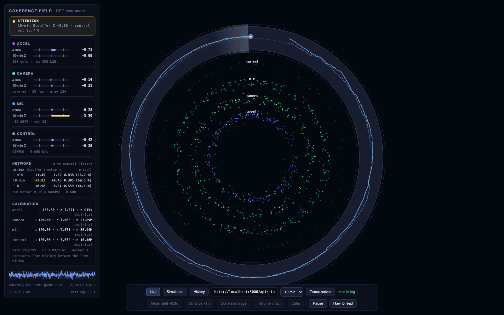
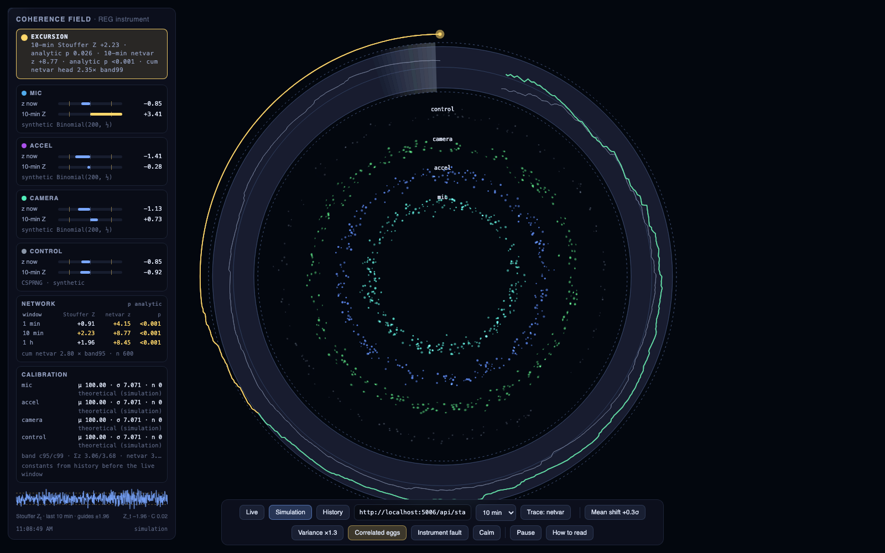

# REG calibration instrument

A GCP / PEAR-style random-event-generator built from this Mac's own physical
noise sources, with the statistical discipline that makes such an instrument
meaningful: per-device empirical calibration, a CSPRNG control run through
byte-identical code, continuous health tests, and covariate logging so every
excursion can be explained or stand on its own.

It replaces the upstream `coherence_monitor`, whose Health metric turned out to
be a step function of a matrix rank (see the project history for the review).

## Eggs (independent physical channels)

| Egg | Physics | Whitening | Rate |
|---|---|---|---|
| `mic` | Mic/ADC thermal noise + room acoustics, float32 at the device's native 44.1 kHz, requantised to 24 bit | bit planes 0–3 (measured fair to bit 6), each XOR-folded 8:1 | ~22 kbit/s |
| `accel` | Built-in accelerometer via IOKit HID (~795 Hz native, 2⁻¹⁶ g steps, ~50 LSB rms noise) | per-axis LSB parity, XOR-folded 4:1 | ~600 bit/s |
| `camera` | Image-sensor noise through the ISP (raw LSB plane is temporally smeared; a 16×16 XOR-fold restores fair bits) | LSB plane folded 16×16, seeded block permutation | ~36 kbit/s |
| `control` | `/dev/random` — the kernel's Fortuna CSPRNG; zero physical content by construction | none | 6 kbit/s |

Bit rate is irrelevant beyond a few hundred bits per second — the GCP uses 200
bits per trial, one trial per second, per device. What matters is residual
serial correlation below ~10⁻³, stationarity over hours, and independence
between eggs. CPU timing jitter was evaluated and excluded (deterministic
function of the 24 MHz clock phase and of machine load).

## What the daemon records

Every wall-clock second, per egg: the canonical 200-bit trial sum (bits
XOR-masked with a fixed alternating template, GCP-style), every further complete
200-bit block as *extra* trials (calibration only — reaches ~10⁶ trials in
hours), bias / lag-1..10 serial correlation / runs test / mask-phase bias on the
pre-mask bits, and the egg's health (levels, device identity, input volume,
frame statistics, helper liveness). Host covariates: load, wall-vs-monotonic
clock drift, loop lateness. SQLite, WAL mode, crash-consistent.

## Running it

From **Terminal.app** (macOS authorises the camera per launching application):

```bash
cd ~/coherence-visualizer/reg && ./run_calibration.sh        # 24 h, detached; safe to close Terminal
tail -f calibration.log                                       # progress
./report.sh                                                   # analysis, any time (writes data/reg_calibration_report.md)
./run_calibration.sh stop                                     # clean stop
```

The report gives per-egg normalisation constants (mean / variance vs the
theoretical 100 / 50), whiteness and the implied trial-variance inflation,
stationarity in 1-min / 5-min / 1-h blocks, cross-egg correlation and the
Stouffer network-variance statistic (physical eggs vs control), covariate
coupling (does the acoustic envelope predict the mic's z²?), and a Monte-Carlo
simultaneous band from the control — the band a live display must use instead
of the classic pointwise parabola, which is exited about half the time under
the null.

## Live instrument (bridge + field)

Once a calibration exists, the live display runs on top of the same daemon:

```bash
cd ~/coherence-visualizer/reg && ../monitor/venv/bin/python reg_bridge.py   # http://localhost:5006
```

`reg_bridge.py` (read-only on the database) scores every second with constants
estimated from history *older* than the live window, computes the GCP
statistics (per-egg z, Stouffer Z across the physical eggs, cumulative Σz and
Σ(z²−1)), bootstraps the simultaneous band and the window null distributions
from the control egg, and serves them as JSON (`/api/state`, `/api/history`,
`/api/calibration`) together with `field.html` at `/`.

`field.html` is the re-mapped Coherence Field:

- each physical egg is a particle family on its own ring with an identity hue
  (mic, accel, camera); the ring breathes with the egg's current z;
- the control egg is a grey ghost family that never changes;
- as the 10-minute network statistic climbs, the families' drift aligns and
  their hues converge toward gold;
- the outer ring is the GCP cumulative-deviation plot bent into a circle, with
  the bootstrap 95 % band drawn as a translucent annulus, the 99 % limits
  dashed, and the control egg's own cumulative trace ghosted alongside —
  the real trace leaving the band while the ghost stays inside is the signal;
- the status chip says CHANCE-LIKE / ATTENTION / EXCURSION with the numbers
  that triggered it, and INSTRUMENT (crimson) for stale eggs, uncalibrated
  constants, restarts or a dead endpoint — never for the physics.

It also has a simulation mode (with injections showing what a mean shift,
variance excess, correlated eggs or an instrument fault look like) and a
history mode that replays any span of the database.

The live field on real data, and a simulated excursion (correlated-eggs
injection) for comparison — note the control ghost trace in both:





## Pre-registration (running an experiment)

Analysis of a week of data shows the network is indistinguishable from the
control in frequency, duration, and magnitude of excursions — as it should be.
The way to ask a real question of it is to **declare the window before it
opens**, so no one (including you) gets to choose what counts after seeing the
data:

```bash
./reg_register.py register --at 20:00 --minutes 20 --label "evening sit" --statistic netvar --direction up
./reg_register.py register --in 5m --minutes 15 --label "group call" --statistic stouffer --direction two-sided
./reg_register.py list
./reg_register.py summary        # the formal series: combined Z over all pre-registered windows
```

A registration fixes start, duration, one primary statistic (`netvar` =
network variance, `stouffer` = mean shift), the hypothesised direction and a
label; it is hashed and appended to `data/registrations.db`, never edited. A
window must start at least 60 s after registration — anything later is
allowed with `--post-hoc` but permanently flagged and kept out of the formal
series. About 30 s after a window closes the bridge evaluates it (or run
`evaluate`): constants come only from data *before* the window, the declared
statistic gets a tail probability from a bootstrap of the control egg's own
history at that window length, and the result records per-egg values, the
control egg's result in the same window, the cumulative-band check, excluded
seconds and covariates. Every registration gets a result row, including
"no data" — there is no file drawer. The formal series combines all
pre-registered windows into one Stouffer Z, with the control's matched
windows combined the same way as the null anchor.

In the field, an open window shows as a gold arc on the outer ring with a
countdown in the status chip, and the **Registered windows** card carries the
running formal result.

## Honest expectations

The GCP's published effect is ~0.3σ per pre-registered event pooled over ~60
devices. A one-to-three-egg home instrument cannot detect an effect that size.
What this instrument can do is show, with a defined null and logged covariates,
whether *your* field ever departs from chance — and exactly what the room was
doing when it did.
